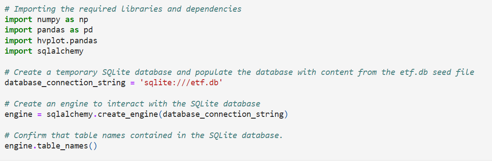
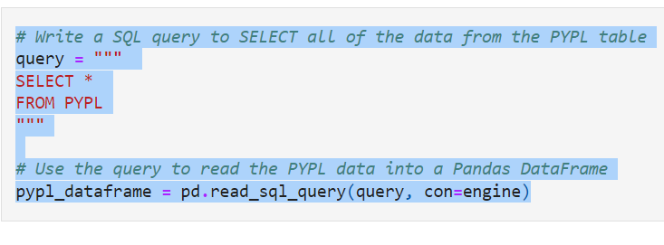
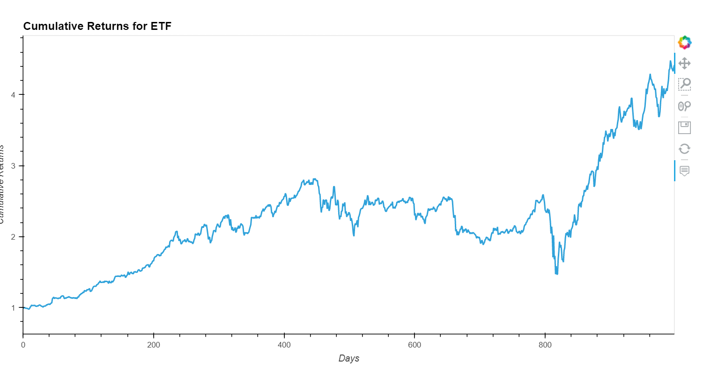

# Fintech-ETF

In recent years, finance has had an explosion in passive investing. Passive investing means that you invest in a basket of assets that’s called an exchange-traded fund (ETF). This way, you don’t spend time researching individual stocks or companies or take the risk of investing in a single stock. ETFs offer more diversification.

I biult a financial database and web application by using SQL, Python, and the Voilà library to analyze the performance of a potential fintech ETF.

---

## Technologies
###### Resource 
- Data Availabe for download: sqlalchemy database

   
###### Tools
import numpy as np
import pandas as pd
import hvplot.pandas
import sqlalchemy

---

## Installation Guide

Installation requirements for this project included Pyton and Panda Libraries, Numpy, HvPlot and SQL 

---

## Results

Final Analysis: 
 

Built the entire ETF portfolio and then evaluate its performance. To do so, I built the ETF portfolio by using SQL joins to combine all the data for each asset.

Cumulative ETF

## Contributors

#### Contact
zehra.vahidy@gmail.com
LinkedIn https://www.linkedin.com/in/zehra-vahidy-6025b820

---

## License

None

## Appendix
https://docs.github.com/en/get-started/writing-on-github/getting-started-with-writing-and-formatting-on-github/basic-writing-and-formatting-syntax#headings
